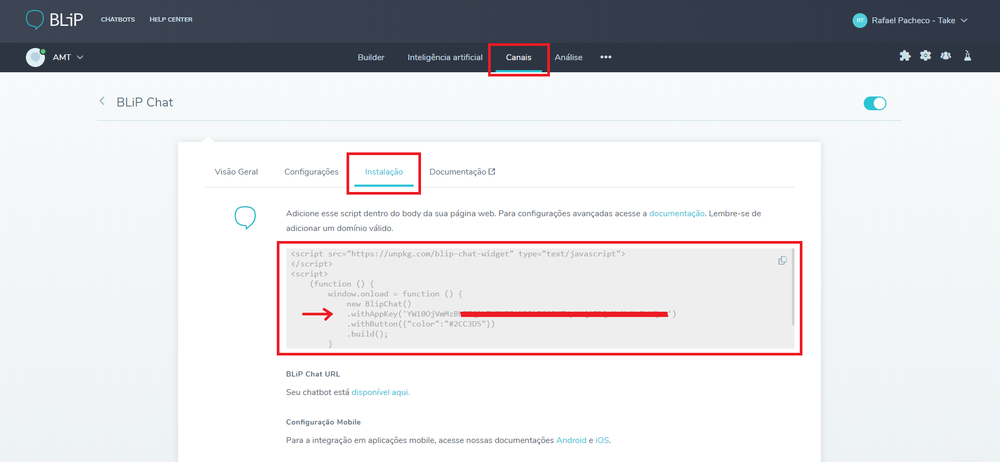

No momento de embarcar o BLiP Chat em um site ou aplicativo móvel é necessário utilizar a ferramenta BLiP Chat Widget. Esta ferramenta permite, entre outras customizações, definir o tipo de autenticação do usuário que está conversando com o bot. Existem basicamente dois tipos de autenticação, GUEST e DEV_AUT.

Este artigo define cada um dos tipos e explica quando você deverá utilizar cada um deles. Por padrão, todo usuário do BLiP Chat é autenticado no modo GUEST.

## Guest

A autenticação do tipo GUEST deve ser utilizada em um chatbot quando não há a necessidade de identificar (ou manter a identificação) o seu usuário, como em um bot FAQ (perguntas e respostas frequentes) em um site não logado.

Nesse modelo, toda vez que o seu chatbot for acessado pela primeira vez em um browser, o BLiP Chat criará um novo usuário e manterá o mesmo por 30 dias. Todo o histórico deste usuário será portanto, mantido por até 30 dias. Depois desse período o BLiP Chat criará outra conta para o usuário.

A opção GUEST é o modo padrão de autenticação do BLiP Chat. Portanto, para adicioná-la em sua página web, não é necessário passar por nenhuma configuração especial, como mostra o exemplo abaixo:

```html
<script src="https://unpkg.com/blip-chat-widget" type="text/javascript"></script>
<script>
 (function () {
      window.onload = function () {
        new BlipChat()
               .withAppKey('YOUR-BLiP-CHAT-KEY')
               .withButton({"color":"#2CC3D5"})
               .build();
      }
 })();
</script>
```
*\* O script acima pode ser encontrado no portal do BLiP acessando o módulo **Canais > BLiP Chat > Instalação**, conforme imagem abaixo:*

<br><br><br>

## DEV_AUTH
O tipo de autenticaçao Dev deve ser escolhido quando houver a necessidade de manter sempre a mesma identificação do cliente que utiliza o BLiP Chat em seu site ou app, por exemplo em ambientes logados. Nesse modo, é possível definir o usuário através de um **identificador** e uma **senha**.

Nesse modo de autenticação, sempre que o usuário acessar o bot será identificado como um mesmo usuário, mantendo assim todo o histórico, por tempo indeterminado.

Neste caso, além da configuração padrão do script do BLiP Chat, é preciso realizar alguns ajustes conforme mostrado no exemplo abaixo.

```html
<script>
    (function () {
        window.onload = function () {
            var builder = new BlipChat()
                 .withAppKey("YOUR-APP-KEY")
                 .withButton({ color: "#2CC3D5" })
                 .withAuth({
                    authType: BlipChat.DEV_AUTH,
                    userIdentity: '1234567',
                    userPassword: 'MTIzNDU2',
                 })
                 .withAccount({
                    fullName: 'John Doe',
                    email:'johndoe@gmail.com',
                    phoneNumber: '+15055034455',
                    city: 'Decatur',
                 });
                 builder.build()
          }
    })();
</script>
```

Note que além de utilizar o método **withAuth** (informando as propriedades authType, userIdentity e userPassword) é possível utilizar também o método **withAccount** para fornecer ainda mais informações do usuário que conversará com o bot. O método withAccount espera como parâmetro um objeto Account. Para conferir todas as propriedades suportadas por esse objeto [clique aqui](https://limeprotocol.org/resources.html#account).

**<p align="center">...</p>**

Para mais detalhes a respeito da utilização dos modos de autenticação do BLiP Chat consulte as documentações [web](https://github.com/takenet/blip-chat-widget) e mobile[ android](https://github.com/takenet/blip-chat-android) e [iOS](https://github.com/takenet/blip-chat-ios).
