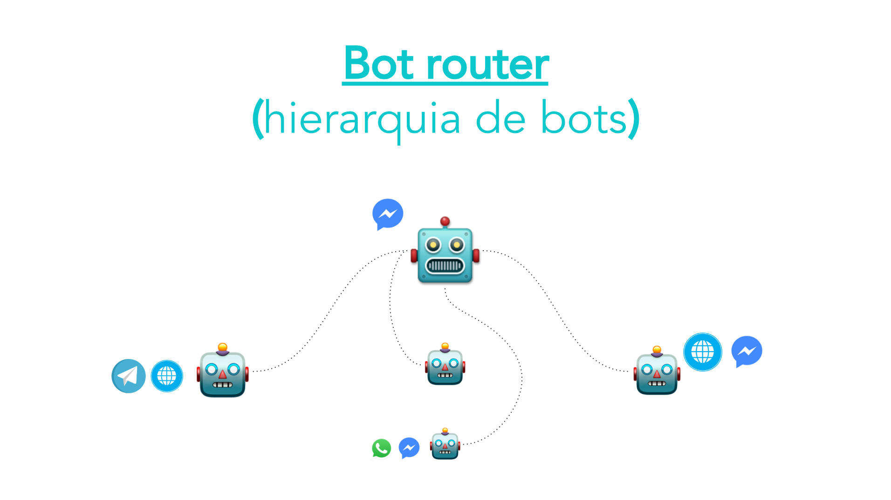
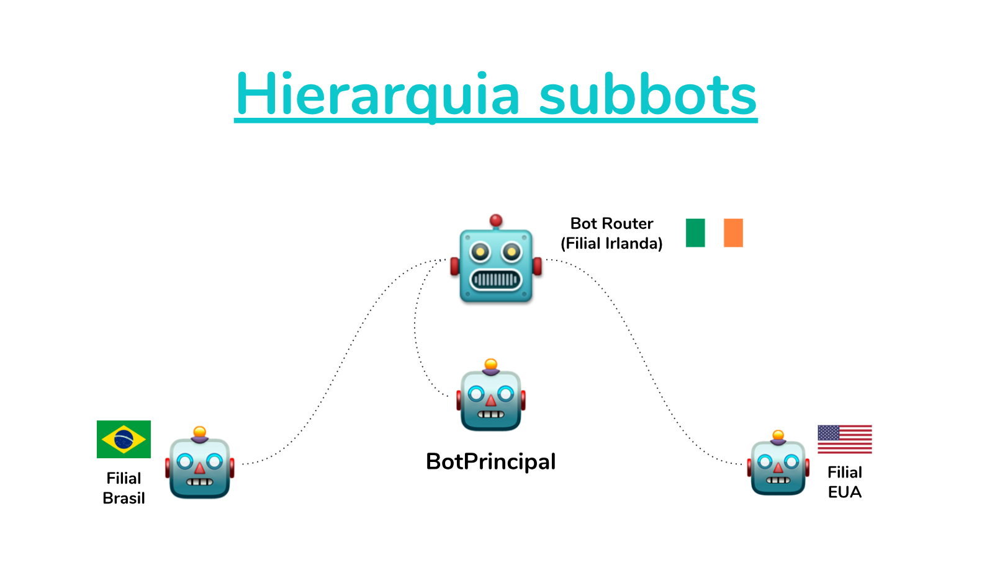

A construção de um software flexível, para solucionar um problema, proporciona à quem o construiu, o poder de replicação e reutilização do mesmo em diferentes contextos. 

Empresas de tecnologia, por exemplo, constroem softwares diariamente e, quase sempre, os reutilizam para solucionar novos tipos de problemas ainda mais complexos. Pense em um banco. Antes mesmo de construir um aplicativo, capaz de exibir o saldo de um correntista, uma instituição financeira precisa de um software capaz de processar o saldo do cliente, ao longo das últimas 24 horas. Idealmente, caso este mesmo cliente queira consultar seu saldo através do site do banco, o mesmo software de processamento será utilizado para retornar os valores. Percebam que o software de processamento tornou-se um ativo do banco e pode/deve ser reaproveitado sempre que necessário.

No mundo dos bots acontece algo bem similar. Sua empresa pode contar com diferentes pontos de relacionamento com os clientes, subdivididos por produtos ou por canais. Entretanto, é fato que em algum momento o assunto/conteúdo conversado, pode ser o mesmo em diferentes locais.

Pensando nesse problema, o BLiP desenvolveu o conceito de bots e subbots. Através de um bot **router** - bot responsável por gerir os subbots, é possível criar uma hierarquia de subbots que trabalharam em conjunto durante a interação do usuário.

  

Uma das vantagens em trabalhar neste modelo é ter a possibilidade de reaproveitar um bot já construido dentro de um novo bot. Imagine, por exemplo, uma empresa que possui filiais no Brasil e nos EUA. A filial brasileira precisa de um bot capaz de atender as solicitações dos clientes na língua portuguesa, enquanto que a filial norte americana precisa que a aplicação seja capaz de atender as solicitações dos clientes em inglês. 

Nesse cenário uma solução interessante seria construir dois bots, um para cada língua e contexto cultural. Contudo, a empresa acabou de fechar um novo contrato e abrirá uma nova filial em Dublin, na Irlanda - país que possui o inglês como língua oficial, mas possui uma grande concentração de pessoas que fala o português. Agora será necessário construir um novo bot capaz de responder aos clientes de acordo com a língua de preferência do cliente (português ou inglês).

Uma solução possível para esse cenário é construir um novo bot com a replicação de todos os dados/conteúdos dos bots criados anteriormente. Entretanto, essa não é uma solução muito flexível, uma vez que os dados estariam duplicados em diferentes locais.

Através da hirarquia de bots e subbots do BLiP, é possível solucionar esse problema adicionando 2 novos bots. O primeiro será o bot **router** - o bot para a filial da Irlanda, capaz de conversar em qualquer língua, e o segundo será o **bot principal**, responsável por descobrir qual a língua de preferência do usuário e enviá-lo à um dos bots já existentes (Brasil ou EUA). O desenho abaixo mostra a arquitetura dessa solução.

  

Repare que os subbots continuam trabalhando para atender as filiais (Brasil e EUA) de forma direta, e agora também podem ajudar no atendimento dos clientes da Irlanda de forma indireta.
Além disso, qualquer correção ou evolução feita nas aplicações Filial Brasil ou Filial EUA também estarão disponíveis para o bot Irlandês.

**Antes de começar a utilizar a hierarquia de bots e subbots do BLiP é preciso entender alguns conceitos teóricos:**

**Bot Router** - bot responsável por gerir os subbots. Este é o bot que o cliente verá, portanto é este bot que deverá ser publicado e testado nos canais. O bot router não possui nenhuma regra ou conteúdo, apenas possui a referência de todos os subbots. Qualquer bot router deve possuir pelo menos 1 subbot.

**SubBot Principal** - Sempre que um usuário conversa com um bot router pela primeira vez ele é direcionado para o subbot principal da hierarquia. Ele é responsável por definir, pela primeira vez, qual subbot atendenrá o cliente. Caso o bot router possua apenas um bot, este será obrigatoriamente o bot principal.

**Subbot** - Qualquer bot pertencente à hierarquia de um bot router.

**Serviço** - Todo subbot é reconhecido como um serviço do bot router. Essa denominação é necessária para que subbots com o mesmo nome possam ser utilizados dentro de um bot router. Será necessário dar um nome (nome do Serviço) para cada subbot. Este será o nome usado para referenciar seu subbot durante a troca entre os bots.

**Expiração do redirecionamento** - É possível definir um tempo de inatividade em cada subbot. Imagine um subbot que só poderá atender o cliente em um tempo específico. Assim o tempo de expiração define um limite, em segundos, do período em que este subbot deve ficar ativo na conversa em relação à última interação do cliente.

Para explicar, passo a passo, como implementar uma arquitetura de bots e subbots semelhante à do exemplo deste texto, preparei o artigo [Criando um bot router com 3 subbots](https://help.blip.ai/hc/pt-br/articles/360008821172). Caso tenha alguma dúvida utilize nosso fórum <http://forum.blip.ai>.
