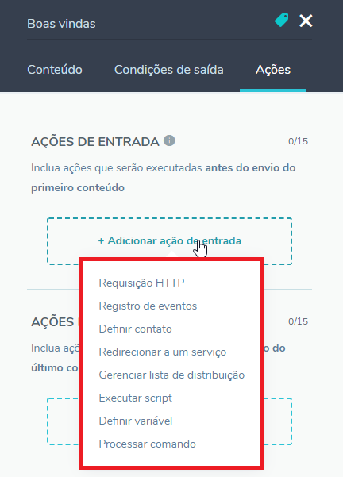
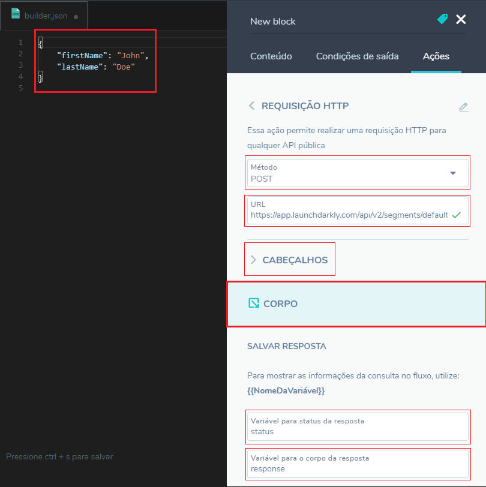
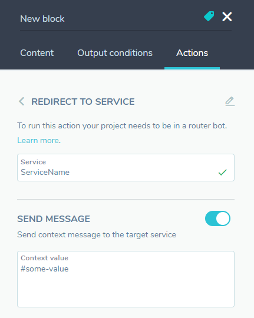

Uma das funções de um bloco (ou estado) é executar ações de entrada e saída. Uma ação representa uma tarefa que deve ser executada antes do envio dos conteúdos de um bloco (**ação de entrada**), ou imediatamente após o envio dos conteúdos (**ação de saída**).

As ações representam o principal ponto de flexibilidade do Builder do BLiP. Através de uma ação, é possível utilizar qualquer funcionalidade do BLiP — como as diversas extensões da plataforma, por exemplo (<https://docs.blip.ai/#extensions>) — além de realizar requisições para qualquer API pública na web.

As ações disponíveis são:

* **Requisição HTTP**

Essa ação permite realizar uma requisição HTTP para qualquer API pública.

Para que o Builder seja capaz de realizar a requisição, é preciso preencher todas as informações necessárias para o request.

| Nome do parâmetro  | Descrição                                                            |
| ----------------- | -------------------------------------------------------------------- |
| **Método**        | Método da requisição HTTP. (Valores suportados: POST, GET, PUT, DELETE, PATCH, OPTIONS, HEAD, TRACE). **Obrigatório** |
| **Url**       | Url completa da requisição. **Obrigatório**    |
| **Corpo** | Objeto que será enviado no corpo (body) da requisição.
| **Cabeçalhos**  | Dicionário (chave e valor) com todos os cabeçalhos necessários para a requisição. Exemplo: `Authorization: key 238912371313`. **Opcional**
| **Variável de Status da resposta** | Variável para receber o status da requisição. Esta variável será preenchida com um dos códigos de status em um requisição HTTP. Exemplo: 200. **Opcional**
| **Variável para corpo da resposta** | Variável para receber o **corpo** da resposta dada pela API. Exemplo: `{"key1": "foo"}`. **Opcional**

* **Registro de evento**
  
Essa ação permite realizar o registro de um evento qualquer no módulo de análise do BLiP. Registro de eventos são necessários para a criação de relatórios customizados.

Todo evento no BLiP é formado por uma **categoria**, uma **ação** e um **conjunto de metadados (opcionais)**. O usuário deve informar essas propriedades para registrar um evento.

* **Definir contato**

Através desta ação, é possível adicionar diversas informações sobre o usuário que está interagindo com o bot. A partir dessas informações, é possível aumentar o conhecimento do seu bot sobre cada um de seus usuários, além de categorizar os clientes de acordo com suas preferências.

Uma vez adicionadas as informações de um contato, é possível visualizá-las em diferentes **módulos** do BLiP. Para saber mais sobre a ação de **Definir Contatos** [clique aqui](https://help.blip.ai/hc/pt-br/articles/360020287152-Salvando-informa%C3%A7%C3%B5es-de-um-usu%C3%A1rio).

* **Gerenciar listas de distribuição**

Uma funcionalidade muito interessante do BLiP é a possibilidade de criar e utilizar listas de distribuição para envios de mensagens direcionadas a um público específico. O módulo de agendamento do BLiP permite agendar e enviar mensagens para listas específicas.

A ação de gerenciamento de listas de distribuição permite adicionar ou remover o usuário que está interagindo com o bot de uma lista.

* **Redirecionar a um serviço**

Pensando em escalabilidade e na administração correta das bases de conhecimento dos bots, o BLiP possui o conceito de hierarquias de bots. Através do Router, é possível criar um bot composto por diversos outros bots.

Neste cenário, para que seja possível trocar o usuário entre os subbots, é necessário utilizar a ação de redirecionamento de serviço, como visto na figura abaixo:

Esta ação é bem simples. Basta informar o identificador do Serviço (bot) para o qual o usuário será direcionado e marcar (caso desejado) o envio da mensagem de contexto ao serviço que tratará as próximas interações do usuário.

Para entender melhor como funciona o **Router**, [clique aqui](https://help.blip.ai/hc/pt-br/articles/360009004831-Hierarquia-ou-arquitetura-de-bots-e-subbots).

**Observações**:

* As ações do Builder **são processadas sequencialmente** (uma após a outra), **até que todas sejam executadas**.
* Ações inválidas, como uma requisição HTTP incorreta, podem bloquear a execução do fluxo de conversa de um usuário. **Fique atento quando cadastrar uma ação em seu bloco**.
