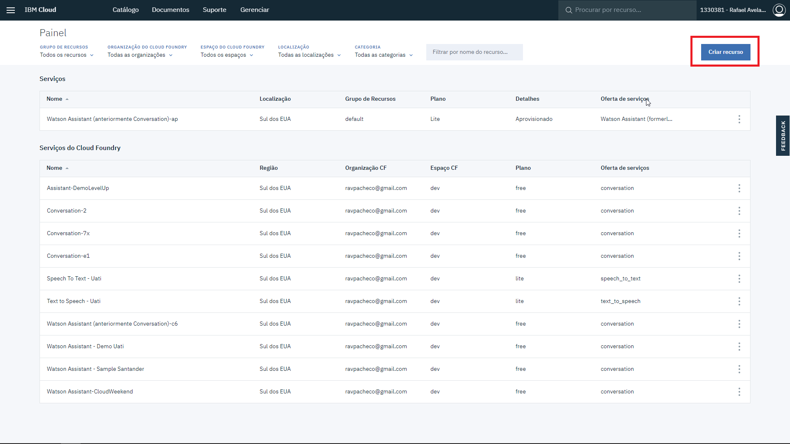
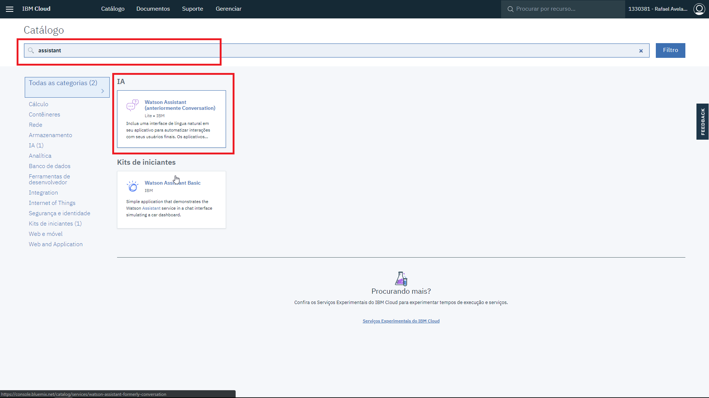
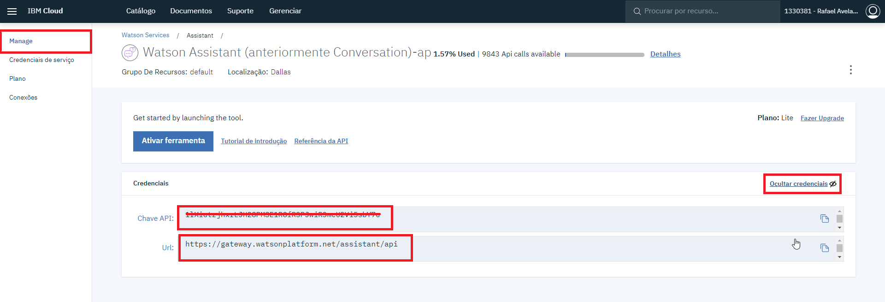

Para ativar a integração entre o BLiP e o serviço Assistant do Watson (antigo **Conversation**) - provedor de **NLP** Natural Language Processing (do português, Processamento de linguagem natural/Entendimento de linguagem natural) da IBM, são necessárias algumas configurações bem simples.

Antes de começar, certifique-se de já ter criado sua conta no Watson através do console do Bluemix. [Clique aqui para criar sua conta](https://console.bluemix.net/).

**1)** Acesse o portal do BLiP, escolha seu bot e selecione o módulo Inteligência Artificial.  
**2)** Escolha o provedor IBM Watson  

 

**3)** Após escolher provedor Watson, clique na aba **Configurações**

**4)** Abra uma nova aba no seu navegador e acesse sua conta no Bluemix. Após realizar login, no dashboard do Bluemix, crie um serviço Watson do tipo **Assistant**.

 

 

**Obs.: Podem haver limites de uso da API dependendo do plano escolhido que podem afetar a utilização do serviço. São necessários pelo menos 3 workspaces para utilização do Conversation no BLiP.**

**5)** Acesse o serviço que você acabou de criar e escolha, no menu lateral, a opção **Manage**. Na listagem de credenciais, escolha a opção **Visualizar credenciais**, copie os valores de API-Key (chave API) e URL apresentados.

 

6) Cole no portal do BLiP os campos coletados no passo anterior e clique em **Salvar**.

 

7) **Pronto, seu provedor de NLP já está configurado**. Para saber mais sobre como utilizar o módulo de Inteligência Artificial do BLiP [clique aqui](https://help.blip.ai/hc/pt-br/articles/360004134312-LevelUp-3-Checklist-de-IA).    

*Obs.: Caso seu serviço Watson Assistant possua o modo de autenticação antigo (credenciais com username e password), utilize seção AUTENTICAÇÃO POR USUÁRIO E SENHA (MODELO ANTIGO DE AUTENTICAÇÃO), na aba de configuração no portal do BLiP, conforme imagem abaixo.*

