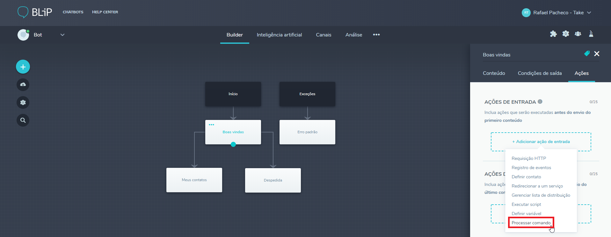
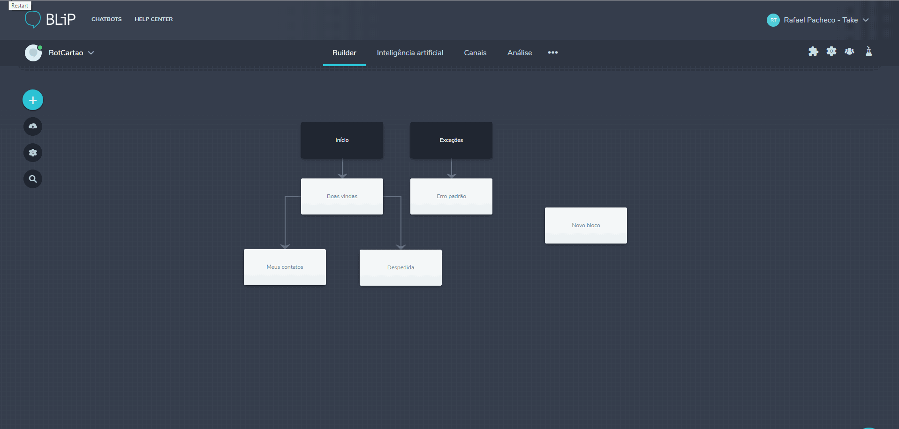

A ação **Processar Comando** foi desenvolvida com o objetivo de facilitar a integração entre o Builder e as APIs internas do BLiP. Na prática, isso significa que a partir de agora é possível utilizar as extensões do BLiP de forma simples, dentro do Builder.

**Extensões** são ferramentas que possibilitam o reaproveitamento e a extensão de vários recursos da plataforma. Através delas é possível por exemplo, agendar mensagens, salvar informações nos bancos de dados do BLiP, buscar histórico de conversas. Veja algumas das principais extensões disponíveis abaixo:

| Extensão | Descrição                                                                                                                                         | 
|--------------------|-----------------------------------------------------------------------------------------------------------------------------------------|
| Inteligência Artificial | Extender os recursos disponíveis no módulo de Inteligência Artificial do BLiP.                                                     | [Saiba mais](https://docs.blip.ai/#artificial-intelligence) |
| Agendamento (Schedulling) | Realiza o envio de mensagens, em nome do seu chatbot, para uma data e horário específico.                                        | [Saiba mais](https://docs.blip.ai/#schedule) |
| Envio em massa (Broadcast)   | Gerencia listas de usuários de seu chatbot e envia mensagens para todos os usuários de uma lista.                             | [Saiba mais](https://docs.blip.ai/#broadcast) |
| Armazenamento (Storage)  | Permite o armazenamento de dados, no formato de documentos JSON, em um local seguro e isolado, acessível apenas pelo seu chatbot. | [Saiba mais](https://docs.blip.ai/#bucket) |
| Diretório (User Info)    | Consulta informações dos usuários (de acordo com o canal utilizado) de seu chatbot, como nome e outros dados pessoais.            | [Saiba mais](https://docs.blip.ai/#user-info) |
| Análise de eventos (Event Track) | Permite o registro, coleta e análise de eventos em tempo real ocorridos em seu chatbot.                                   | [Saiba mais](https://docs.blip.ai/#event-analysis) |
| Histórico de conversas (History) | Possibilita a consulta das últimas mensagens trocadas entre seu chatbot e um determinado usuário de um canal.             | [Saiba mais](https://docs.blip.ai/#chat-history) |
| Perfil do bot (Chatbot Profile) | Possibilita a alteração de informações do bot                                                                              | [Saiba mais](https://docs.blip.ai/#chatbot-profile) |

Para consultar a documentação completa de todas as extensões [clique aqui](https://docs.blip.ai/#extensions).

## Exemplo

Veja, no GIF abaixo, um exemplo de como agendar uma mensagem para um usuário (fictício com identificador destination@0mn.io) utilizando a extensão de **Agendamento** (Scheduler).

