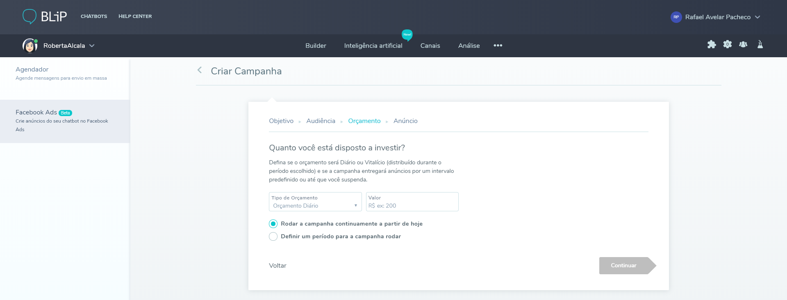

O módulo *Growth* - do inglês crescimento, é o módulo da plataforma responsável por ajudar a aumentar, o número e o engajamento da base de usuários do seu bot. Através deste módulo, é possível buscar novos usuários ou chamar a atenção de usuários que não interagem com sua aplicação por algum tempo.

**Facebook Ads** é uma das ferramentas de *Growth* do BLiP*, responsável por gerenciar suas campanhas de anúncios do Facebook. A partir destas campanhas é possível buscar novos clientes para o seu bot, analisando não só os interesses de sua empresa como também o perfil dos usuários que já utilizam seu chatbot.

Os clientes impactados por sua campanha serão incentivados a clicarem em um botão que leva-os para conversar diretamente com o bot, através do Facebook Messenger. Este processo é conhecido também como *Click to Messenger* - Clique para o Messenger. Para utilizar a ferramenta **Facebook Ads**, siga os passos abaixo:

## Pré-requisitos:

Antes de começar é preciso verificar se todos os pré-requisitos necessários para utilizar a ferramenta já foram atendidos, são eles:

1. Verifique se seu bot está publicado no canal Facebook Messenger
2. Verifique se você já tem uma conta de negócios no Facebook. Caso não tenha basta vincular sua conta do Facebook ao portal business [neste link](https://business.facebook.com/).
3. Adicione ao menos um método de pagamento em sua conta business do Facebook (cartão de crédito ou voucher de desconto, por exemplo).

## Criando sua primeira campanha:

Para criar sua primeira campanha de anúncio do Facebook siga os passos abaixo:

1. Acesse seu bot no portal do BLiP e escolha o módulo ***Growth*** clicando na opção mais módulos (representado pelo ícone de três pontos) no menu superior. Já no módulo ***Growth***, escolha a opção **Facebook Ads** no menu lateral esquerdo e clique no botão **Criar Campanha** (veja imagem abaixo).

2. Escolha o objetivo e dê um nome para sua campanha. Atualmente, apenas as campanhas para **Conquistar mais usuários** (através de clique para o Messenger) estão disponíveis.

3. Defina a audiência da sua campanha de acordo com o seu objetivo. Esse é o momento de definir o que é essencial para você: volume de usuários **vs** qualidade da base.

4. Agora, escolha qual será o orçamento da sua campanha. É possível definir um tempo de validade da campanha ou apenas o valor total do seu investimento.

5. Por fim, é necessário configurar o conteúdo do anúncio. Essa é a parte mais importante da sua campanha, afinal o que você definir nesta etapa será visualizado pelos clientes no Facebook.

Além de preencher a imagem e os dados do anúncio é possível analisar como ele aparecerá para os usuários tanto no *desktop* quando nos dispositivos móveis.

6. Após criada a campanha, o BLiP envia todas as informações para o Facebook. Você receberá uma notificações do Facebook, depois de alguns minutos, informando se seu anúncio foi aprovado ou não.

\* *Integração realizada em parceria com a **SugarAds**.*
