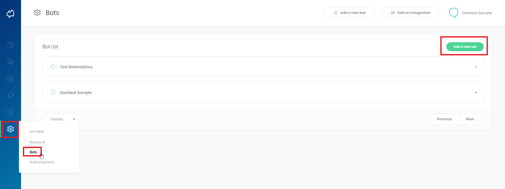
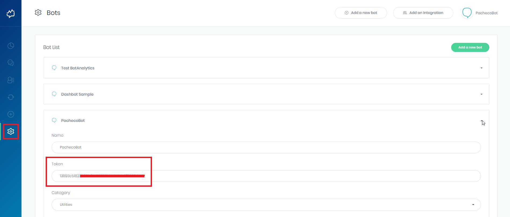

Para enviar as informações geradas pelo seu bot, automaticamente, para o BotAnalytics é preciso configurar no BLiP a API-KEY do seu bot fornecida pela ferramenta. Siga os passos abaixo para realizar a integração.

## 1 - Criando um bot no BotAnalytics

Caso já possua um bot no BotAnalytics, vá para a etapa 2 (**Adicionando Token do BotAnalytics no BLiP**). Caso contrário, siga todos os passos abaixo:

a) Acesse o **BotAnalytics**
b) Crie uma conta ou faça login em sua conta
c) Clique em Configurações > Bots e depois no botão **Add a new bot**

 

d) Escolha a plataforma **BLiP** como plataforma de construção do seu bot e depois entre com as demais informações: nome do bot, categoria que melhor se aplica à sua aplicação e opcionalmente uma URL para o site e para a imagem do seu bot.

**ATENÇÃO: VOCÊ DEVE ESCOLHER O BLiP COMO PLATAFORMA DO SEU BOT.**

 

e) Copie o Token de acesso do seu bot.

 

**Obs.: Você pode encontrar o Token do seu bot sempre que precisar acessando**: *Configurações > Bots > Detalhes do seu bot*

 

## 2 - Adicionando Token do BotAnalytics no BLiP

De posse do Token do seu bot no BotAnalytics, vá até o portal do BLiP, selecione o seu bot e clique m Integrações (conforme imagem abaixo).

 

Escolha a integração **BotAnalytics** e clique na aba **Configurações**. Preencha o campo API-KEY com a chave gerada pelo BotAnalytics na etapa anterior e clique em salvar. Depois disso clique na chave **Ativar** (no campo superior direito) para ativar a integração.

 

## 3 - Testando a integração

Todas as mensagens enviadas e recebidas pelo bot são enviadas automaticamente para o BotAnalytics. Depois de realizar alguma interação com seu bot, vá até o painel do BotAnalytics e veja o resultado.

**Obs.: Para saber mais sobre todas as métricas geradas pelo BotAnalytics [veja este link](http://help.botanalytics.co/).**