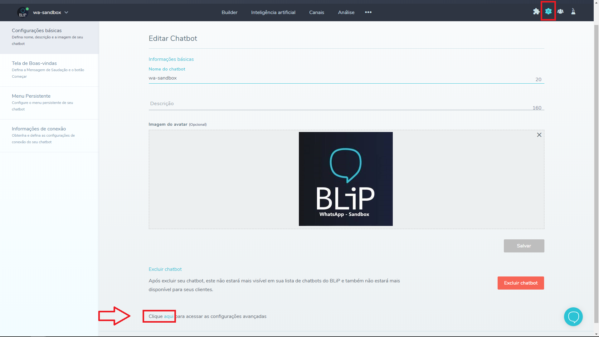

Em certos momentos, o desenvolvedor do bot pode precisar ter acesso a algumas configurações internas que o BLiP armazena, como o **token de autenticação do Messenger**, por exemplo.

Para isso, basta acessar a tela de configurações do seu bot (o ícone com uma engrenagem no canto superior direito do portal), rolar a tela até embaixo e clicar no link de acesso as <u>configurações avançadas</u>.

A tela de configurações avançadas lista várias configurações que o BLiP armazena sobre um determinado bot, sendo possível ler, alterar e excluir seus valores. Lembre-se, grandes poderes trazem grandes responsabilidades 🕷️🕸️.

**
 ... 
**

**ATENÇÃO: Não altere nenhum valor nessa tela a menos que tenha certeza do que está fazendo. Qualquer modificação indevida pode fazer com que seu bot deixe de funcionar corretamente. 😉**